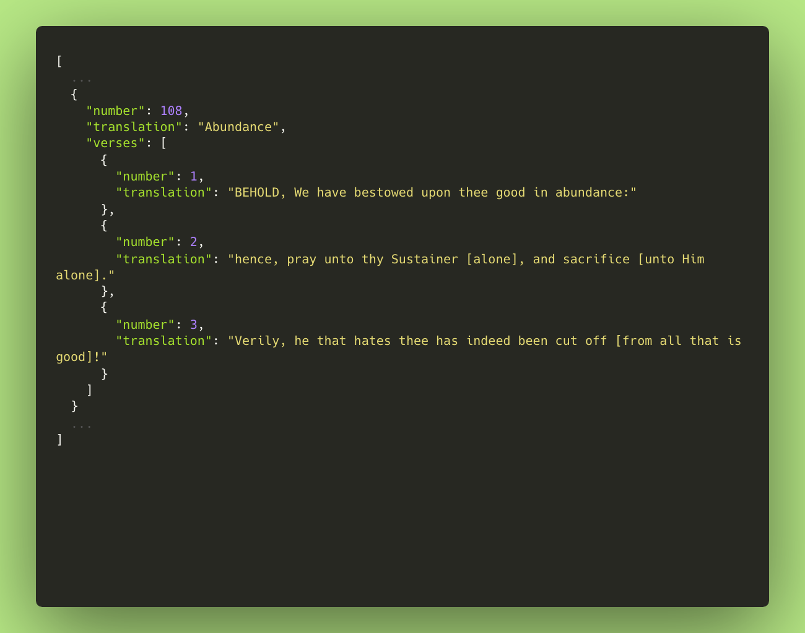
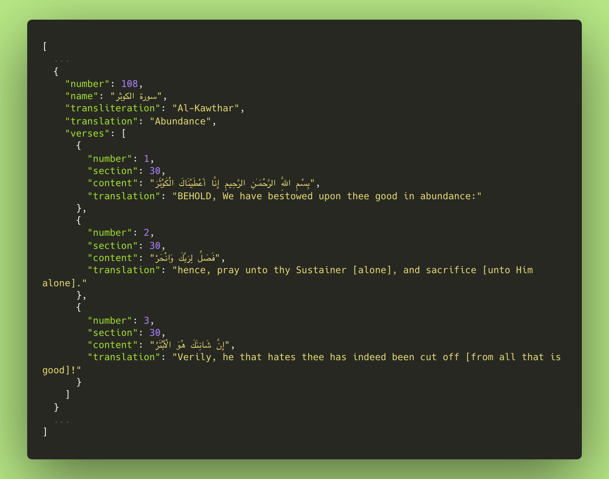

# QURAN

بِسْمِ ٱللّٰهِ الرَّحْمٰنِ الرَّحِيْمِ

This repository is intended for **transliteration**, **translation**, **edition**, and **structure** management.

The Quran has never changed and never will, because Allah protecting it. ```(15:9) إِنَّا نَحۡنُ نَزَّلۡنَا ٱلذِّكۡرَ وَإِنَّا لَهُۥ لَحَـٰفِظُونَ```.

## Formats

| Stand-alone | Full |
|---|---|
|  |  |


## Editions

| Language | Edition | Identifier | Type | Status |
|---|---|---|---|---|
| Albanian | Feti Mehdiu | `sq.mehdiu` | Translation | [](#) [](#) |
| Albanian | Hasan Efendi Nahi / Efendi Nahi | `sq.nahi` | Translation | [](#) [](#) |
| Albanian | Sherif Ahmeti | `sq.ahmeti` | Translation | [](#) [](#) |
| Arabic | King Fahad Quran Complex / تفسير المیسر | `ar.muyassar` | Tafsir | [](#) [](#) |
| Arabic | Jalal ad-Din al-Mahalli and Jalal ad-Din as-Suyuti / تفسير الجلالين | `ar.jalalayn` | Tafsir | [](#) [](#) |
| Azerbaijani | Vasim Mammadaliyev and Ziya Bunyadov / Məmmədəliyev & Bünyadov | `az.mammadaliyev` | Translation | [](#) [](#) |
| Azerbaijani | Alikhan Musayev / Musayev | `az.musayev` | Translation | [](#) [](#) |
| Bengali, Bangla | Muhiuddin Khan / মুহিউদ্দীন খান | `bn.bengali` | Translation | [](#) [](#) |
| Bosnian | Mustafa Mlivo / Mlivo | `bs.mlivo` | Translation | [](#) [](#) |
| Bosnian | Besim Korkut / Korkut | `bs.korkut` | Translation | [](#) [](#) |
| Bulgarian | Tzvetan Theophanov / Теофанов | `bg.theophanov` | Translation | [](#) [](#) |
| Chinese | Ma Jian | `zh.jian` | Translation | [](#) [](#) |
| Chinese | Ma Jian / Ma Jian (Traditional) | `zh.majian` | Translation | [](#) [](#) |
| Czech | A. R. Nykl / Nykl | `cs.nykl` | Translation | [](#) [](#) |
| Czech | Preklad I. Hrbek / Hrbek | `cs.hrbek` | Translation | [](#) [](#) |
| Divehi, Dhivehi, Maldivian | Office of the President of Maldives / ދިވެހި | `dv.divehi` | Translation | [](#) [](#) |
| Dutch | Salomo Keyzer / Keyzer | `nl.keyzer` | Translation | [](#) [](#) |
| English | Abul Ala Maududi / Maududi | `en.maududi` | Translation | [](#) [](#) |
| English | Abdullah Yusuf Ali / Yusuf Ali | `en.yusufali` | Translation | [](#) [](#) |
| English | Muhammad Sarwar / Sarwar | `en.sarwar` | Translation | [](#) [](#) |
| English | Saheeh International | `en.sahih` | Translation | [](#) [](#) |
| English | Mohammad Habib Shakir / Shakir | `en.shakir` | Translation | [](#) [](#) |
| English | Mohammed Marmaduke William Pickthall / Pickthall | `en.pickthall` | Translation | [](#) [](#) |
| English | Muhammad Taqi-ud-Din al-Hilali and Muhammad Muhsin Khan / Hilali & Khan | `en.hilali` | Translation | [](#) [](#) |
| English | Abdul Majid Daryabadi / Daryabadi | `en.daryabadi` | Translation | [](#) [](#) |
| English | Muhammad Asad / Asad | `en.asad` | Translation | [](#) [](#) |
| English | A. J. Arberry / Arberry | `en.arberry` | Translation | [](#) [](#) |
| English | Ahmed Raza Khan | `en.ahmedraza` | Translation | [](#) [](#) |
| English | Ahmed Ali | `en.ahmedali` | Translation | [](#) [](#) |
| English | Hasan al-Fatih Qaribullah and Ahmad Darwish / Qaribullah & Darwish | `en.qaribullah` | Translation | [](#) [](#) |
| French | Muhammad Hamidullah / Hamidullah | `fr.hamidullah` | Translation | [](#) [](#) |
| German | Adel Theodor Khoury / Khoury | `de.khoury` | Translation | [](#) [](#) |
| German | Amir Zaidan / Zaidan | `de.zaidan` | Translation | [](#) [](#) |
| German | A. S. F. Bubenheim and N. Elyas / Bubenheim & Elyas | `de.bubenheim` | Translation | [](#) [](#) |
| German | Abu Rida Muhammad ibn Ahmad ibn Rassoul / Abu Rida | `de.aburida` | Translation | [](#) [](#) |
| Hausa | Abubakar Mahmoud Gumi / Gumi | `ha.gumi` | Translation | [](#) [](#) |
| Hindi | Muhammad Farooq Khan and Muhammad Ahmed / फ़ारूक़ ख़ान & अहमद | `hi.farooq` | Translation | [](#) [](#) |
| Hindi | Suhel Farooq Khan and Saifur Rahman Nadwi / फ़ारूक़ ख़ान & नदवी | `hi.hindi` | Translation | [](#) [](#) |
| Indonesian | Muhammad Quraish Shihab et al. / Quraish Shihab | `id.muntakhab` | Translation | [](#) [](#) |
| Indonesian | Bahasa Indonesia | `id.indonesian` | Translation | [](#) [](#) |
| Italian | Hamza Roberto Piccardo / Piccardo | `it.piccardo` | Translation | [](#) [](#) |
| Japanese | Japanese | `ja.japanese` | Translation | [](#) [](#) |
| Korean | Korean | `ko.korean` | Translation | [](#) [](#) |
| Kurdish | Burhan Muhammad-Amin / ته‌فسیری ئاسان | `ku.asan` | Translation | [](#) [](#) |
| Malay | Abdullah Muhammad Basmeih / Basmeih | `ms.basmeih` | Translation | [](#) [](#) |
| Malayalam | Cheriyamundam Abdul Hameed and Kunhi Mohammed Parappoor / അബ്ദുല്‍ ഹമീദ് & പറപ്പൂര്‍ | `ml.abdulhameed` | Translation | [](#) [](#) |
| Norwegian | Einar Berg | `no.berg` | Translation | [](#) [](#) |
| Persian (Farsi) | Mohammad Kazem Moezzi / معزی | `fa.moezzi` | Translation | [](#) [](#) |
| Persian (Farsi) | Mohammad Mahdi Fooladvand / فولادوند | `fa.fooladvand` | Translation | [](#) [](#) |
| Persian (Farsi) | Sayyed Jalaloddin Mojtabavi / مجتبوی | `fa.mojtabavi` | Translation | [](#) [](#) |
| Persian (Farsi) | Baha'oddin Khorramshahi / خرمشاهی | `fa.khorramshahi` | Translation | [](#) [](#) |
| Persian (Farsi) | Abolfazl Bahrampour / بهرام پور | `fa.bahrampour` | Translation | [](#) [](#) |
| Persian (Farsi) | Hussain Ansarian / انصاریان | `fa.ansarian` | Translation | [](#) [](#) |
| Persian (Farsi) | Naser Makarem Shirazi / مکارم شیرازی | `fa.makarem` | Translation | [](#) [](#) |
| Persian (Farsi) | Mahdi Elahi Ghomshei / الهی قمشه‌ای | `fa.ghomshei` | Translation | [](#) [](#) |
| Persian (Farsi) | Mostafa Khorramdel / خرمدل | `fa.khorramdel` | Translation | [](#) [](#) |
| Persian (Farsi) | AbdolMohammad Ayati / آیتی | `fa.ayati` | Translation | [](#) [](#) |
| Polish | Józefa Bielawskiego / Bielawskiego | `pl.bielawskiego` | Translation | [](#) [](#) |
| Portuguese | Samir El-Hayek / El-Hayek | `pt.elhayek` | Translation | [](#) [](#) |
| Romanian | George Grigore / Grigore | `ro.grigore` | Translation | [](#) [](#) |
| Russian | Magomed-Nuri Osmanovich Osmanov / Османов | `ru.osmanov` | Translation | [](#) [](#) |
| Russian | V. Porokhova / Порохова | `ru.porokhova` | Translation | [](#) [](#) |
| Russian | Abu Adel / Абу Адель | `ru.abuadel` | Translation | [](#) [](#) |
| Russian | Ignaty Yulianovich Krachkovsky / Крачковский | `ru.krachkovsky` | Translation | [](#) [](#) |
| Russian | Ministry of Awqaf, Egypt / Аль-Мунтахаб | `ru.muntahab` | Translation | [](#) [](#) |
| Russian | Gordy Semyonovich Sablukov / Саблуков | `ru.sablukov` | Translation | [](#) [](#) |
| Russian | Elmir Kuliev / Кулиев | `ru.kuliev` | Translation | [](#) [](#) |
| Sindhi | Taj Mehmood Amroti / امروٽي | `sd.amroti` | Translation | [](#) [](#) |
| Somali | Mahmud Muhammad Abduh / Abduh | `so.abduh` | Translation | [](#) [](#) |
| Spanish | Muhammad Asad - Abdurrasak Pérez / Asad | `es.asad` | Translation | [](#) [](#) |
| Spanish | Julio Cortes / Cortes | `es.cortes` | Translation | [](#) [](#) |
| Swahili | Ali Muhsin Al-Barwani / Al-Barwani | `sw.barwani` | Translation | [](#) [](#) |
| Swedish | Knut Bernström / Bernström | `sv.bernstrom` | Translation | [](#) [](#) |
| Tajik | AbdolMohammad Ayati / Оятӣ | `tg.ayati` | Translation | [](#) [](#) |
| Tamil | Jan Turst Foundation / ஜான் டிரஸ்ட் | `ta.tamil` | Translation | [](#) [](#) |
| Tatar | Yakub Ibn Nugman | `tt.nugman` | Translation | [](#) [](#) |
| Thai | King Fahad Quran Complex / ภาษาไทย | `th.thai` | Translation | [](#) [](#) |
| Turkish | Diyanet Isleri / Diyanet İşleri | `tr.diyanet` | Translation | [](#) [](#) |
| Turkish | Edip Yüksel | `tr.yuksel` | Translation | [](#) [](#) |
| Turkish | Alİ Bulaç | `tr.bulac` | Translation | [](#) [](#) |
| Turkish | Yasar Nuri Ozturk / Öztürk | `tr.ozturk` | Translation | [](#) [](#) |
| Turkish | Suleyman Ates / Süleyman Ateş | `tr.ates` | Translation | [](#) [](#) |
| Turkish | Abdulbaki Golpinarli / Abdulbakî Gölpınarlı | `tr.golpinarli` | Translation | [](#) [](#) |
| Turkish | Suat Yildirim / Suat Yıldırım | `tr.yildirim` | Translation | [](#) [](#) |
| Turkish | Elmalili Hamdi Yazir / Elmalılı Hamdi Yazır | `tr.yazir` | Translation | [](#) [](#) |
| Turkish | Diyanet Vakfi / Diyanet Vakfı | `tr.vakfi` | Translation | [](#) [](#) |
| Turkish | Muhammet Abay / Çeviriyazı | `tr.transliteration` | Transliteration | [](#) [](#) |
| Urdu | Fateh Muhammad Jalandhry / جالندہری | `ur.jalandhry` | Translation | [](#) [](#) |
| Urdu | Syed Zeeshan Haider Jawadi / علامہ جوادی | `ur.jawadi` | Translation | [](#) [](#) |
| Urdu | Ahmed Raza Khan / احمد رضا خان | `ur.kanzuliman` | Translation | [](#) [](#) |
| Urdu | Tahir ul Qadri / طاہر القادری | `ur.qadri` | Translation | [](#) [](#) |
| Urdu | Muhammad Junagarhi / محمد جوناگڑھی | `ur.junagarhi` | Translation | [](#) [](#) |
| Urdu | Abul A'ala Maududi / ابوالاعلی مودودی | `ur.maududi` | Translation | [](#) [](#) |
| Urdu | Ahmed Ali / احمد علی | `ur.ahmedali` | Translation | [](#) [](#) |
| Uyghur | Muhammad Saleh / محمد صالح | `ug.saleh` | Translation | [](#) [](#) |
| Uzbek | Muhammad Sodik Muhammad Yusuf / Мухаммад Содик | `uz.sodik` | Translation | [](#) [](#) |

## Glossary

- **Chapter - [Surah](https://en.wikipedia.org/wiki/Surah)**

  > A surah (/ˈsʊərə/;[1] Arabic: سورة, romanized: sūrah) is the equivalent of "chapter" in the Qur'an.

- **Verse - [Āyah](https://en.wikipedia.org/wiki/%C4%80yah)**

  > An Ayah (Arabic: آية, romanized: ʾĀyah, Arabic pronunciation: [ʔaː.ja]; plural: آيات ʾĀyāt) is a "verse" in the Quran, one of the statements of varying length that make up the chapters (surah) of the Quran and are marked by a number.

- **Section - [Juz'](https://en.wikipedia.org/wiki/Juz%27)**

  > A juzʼ (Arabic: جُزْءْ, plural: أَجْزَاءْ ajzāʼ,[1] literally meaning "part") is one of thirty parts of varying lengths into which the Quran is divided.

## Credits

- [Wahyu Kristianto](https://github.com/kristories)
- [Islamic Network](https://islamic.network) (Initial data source)
- [Tanzil](https://tanzil.net) (Initial data source)
- [All Contributors](https://github.com/Kristories/quran/graphs/contributors)
